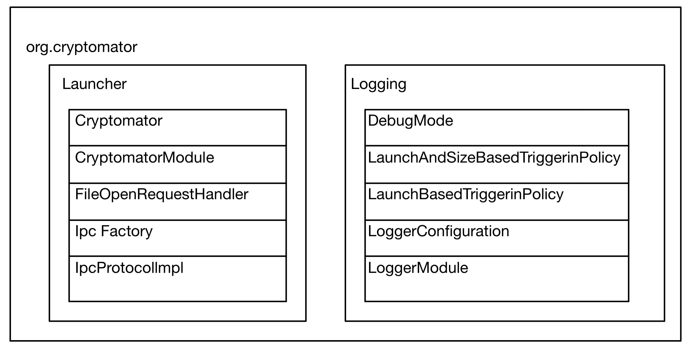
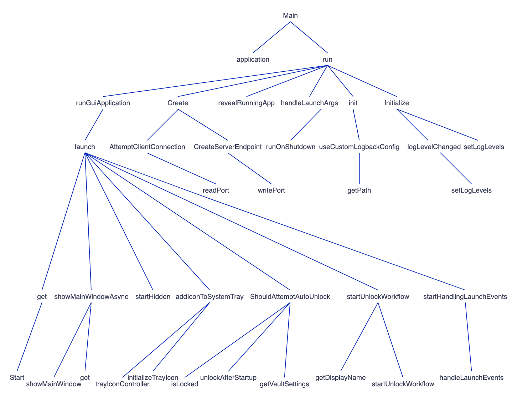
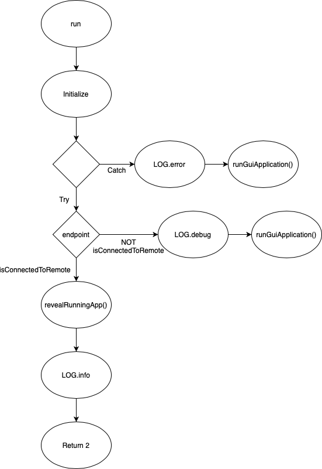
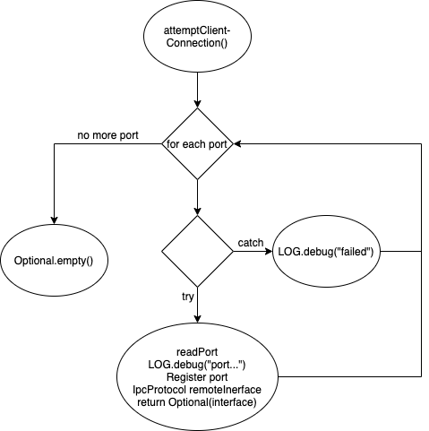
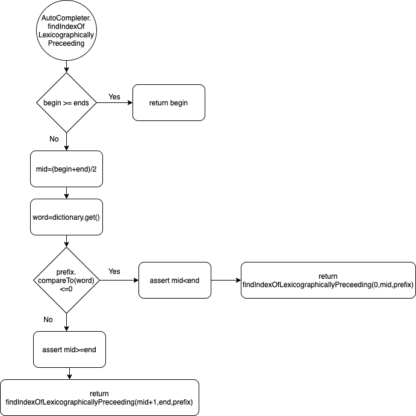
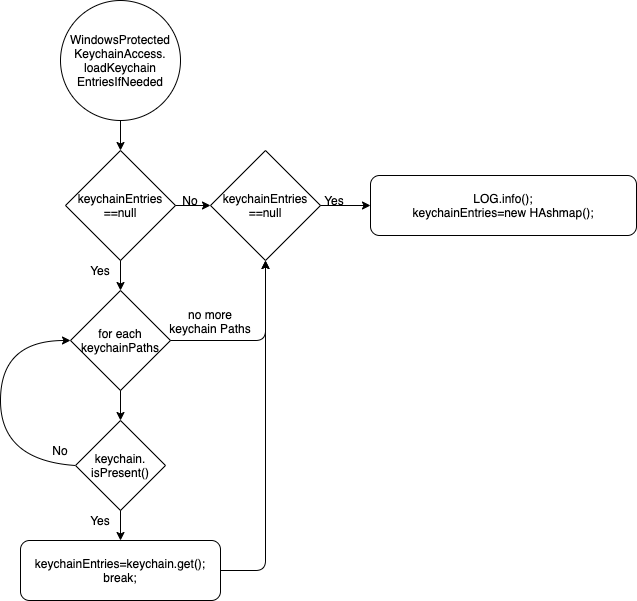
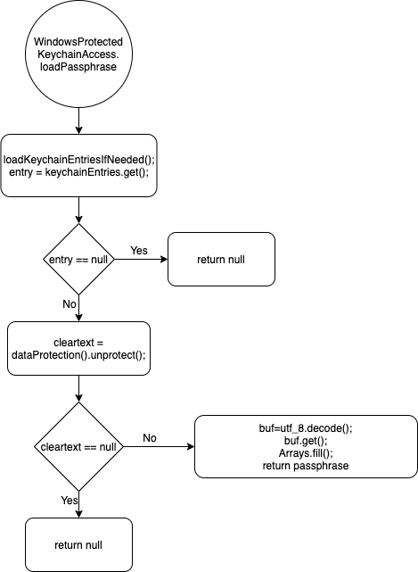
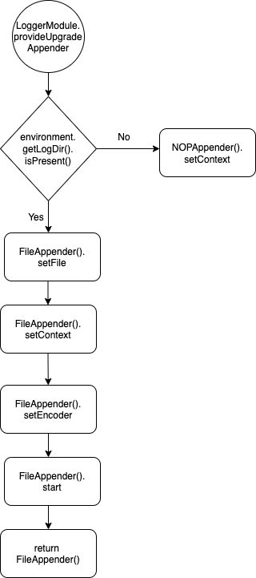

# Software Construction - Assigment 1

- Dubach Rafael (18-755-140)
- Hoffmann Felix (14-591-549)
- Wäspi Raphael (18-918-938)

## PART 1.1 - ARCHITECTURE

We picked launcher, logging, and org.cryptomator packages in this task to get 
an overall overview on Cryptomator. The main reason why we chose these packages 
is because you start the program with the class Cryptomator in the package launcher and 
since our 3 packages contain exactly 10 classes it was the perfect fit. Each class 
imports the entire package it is also part of and therefore we have a strong cohesion. 
## PART 1.2 - CALL GRAPH

## PART 2 - DATA FLOW
### run

### attemptClientConnection

### findIndexOfLexicographicallyPreceeding

### loadKeychainEntriesIfNeeded

### loadPassphrase

### provideUpgradeAppender
