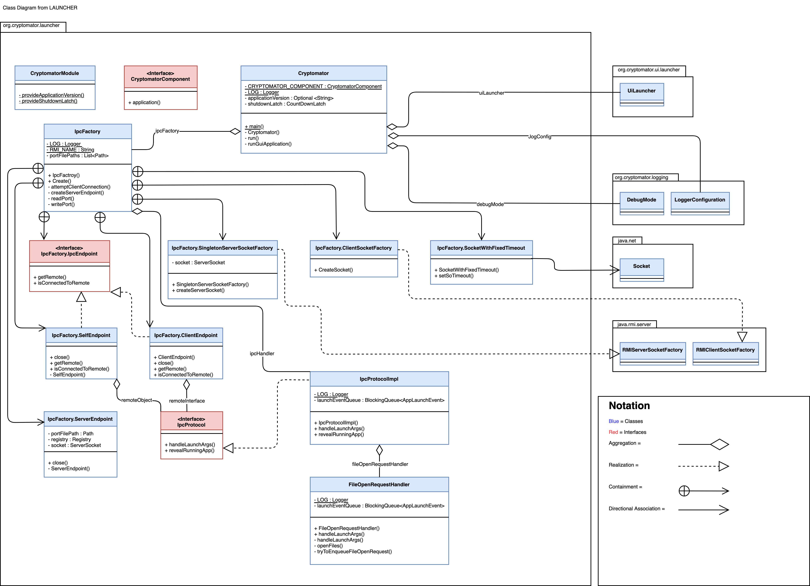

# Software Construction - Assigment 1

- Dubach Rafael (18-755-140)
- Hoffmann Felix (14-591-549)
- Wäspi Raphael (18-918-938)

## PART 1 - Our Code
We have copied the Code from the Java files into this Answer file. This might be in conflict with some notation like comments. We advice, for convenience reasons, to focus on the original code in the Java files. 

### Class Main 
public class Main {

    //Function which makes the input, checking and drawing
    public static void creator(Ships s, Board b){
        String pos = s.input();

        while(!b.checking(pos, s.getSize())){
            System.out.println("Specified input is invalid");
            pos =s.input();
        }
        b.drawShip(pos, s.getSize(), s.getType());
    }

    public static void main(String[] args) {
        System.out.println("Welcome to Battleship!! \n");

        //init of Board
        Board b = new Board();

        Carrier c = new Carrier();
        creator(c, b);

        Battleship b1 = new Battleship();
        creator(b1, b);

        Battleship b2 = new Battleship();
        creator(b2, b);

        Submarine s1 = new Submarine();
        creator(s1, b);

        Submarine s2 = new Submarine();
        creator(s2, b);

        Submarine s3 = new Submarine();
        creator(s3, b);

        Patrol_Boat p1 = new Patrol_Boat();
        creator(p1, b);

        Patrol_Boat p2 = new Patrol_Boat();
        creator(p2, b);

        Patrol_Boat p3 = new Patrol_Boat();
        creator(p3, b);

        Patrol_Boat p4 = new Patrol_Boat();
        creator(p4, b);

        //Print the board
        b.printBoard();

    }
}
### Interface Ship
public interface Ships {
    //All methods which must be in every ship

    //Asks for the input. Returns the position of the ship
    public String input();

    //Encapsulation for the size of the ships
    public int getSize();

    //Get the Type of the ship (B or C or S or P). This will be in the Board!
    public String getType();

}
### Class Carrier
import java.util.Scanner;

public class Carrier implements Ships{

    public String input(){
        Scanner MyScanner = new Scanner(System.in);
        System.out.print("Please enter the position of your Carrier: ");
        String ship = MyScanner.nextLine();
        return ship;
    }

    public int getSize(){
        return 6;
    }

    public String getType(){
        return "C";
    }

}
### Class Battleship
import java.util.Scanner;

public class Battleship implements Ships{

    //This is important for the output!
    private static int counter = 0;

    //Constructor
    public Battleship(){
        counter+=1; //If in main new Battleship(), then the counter is +=1
    }

    public String input(){
        Scanner MyScanner = new Scanner(System.in);
        System.out.print("Please enter the position of your BattleShip " + counter + ": ");
        String ship = MyScanner.nextLine();
        return ship;
    }

    public int getSize(){
        return 4;
    }

    public String getType(){
        return "B";
    }

}
//int[] myIntArray = new int[3];
### Class Submarine
import java.util.Scanner;

public class Submarine implements Ships{

    //If this class gets initialized, the counter is +=1. This is important for the output!
    private static int counter = 0;

    //Constructor
    public Submarine(){
        counter+=1; //If in main new Submarine(), then the counter is +=1
    }

    public String input(){
        Scanner MyScanner = new Scanner(System.in);
        System.out.print("Please enter the position of your Submarine " + counter + ": ");
        String ship = MyScanner.nextLine();
        return ship;
    }

    public int getSize(){
        return 3;
    }

    public String getType(){
        //This will be in the Board
        return "S";
    }
}
### Class Patrol_Boat
import java.util.Scanner;

public class Patrol_Boat implements Ships{

    //If this class gets initialized, the counter is +=1. This is important for the output!
    private static int counter = 0;

    //Constructor
    public Patrol_Boat(){
        counter+=1; //If in main new Patrol_Boat(), then the counter is +=1
    }

    public String input(){
        Scanner MyScanner = new Scanner(System.in);
        System.out.print("Please enter the position of your Patrol Boat " + counter + ": ");
        String ship = MyScanner.nextLine();
        return ship;
    }

    public int getSize(){
        return 2;
    }

    public String getType(){
        //This will be in the Board
        return "P";
    }
}
### Class Board
import java.util.Arrays;

public class Board {

    //init two dim array with spaces
    private String[][] arr = {{" "," "," "," "," "," "," "," "," "," "},{" "," "," "," "," "," "," "," "," "," "},{" "," "," "," "," "," "," "," "," "," "},{" "," "," "," "," "," "," "," "," "," "},{" "," "," "," "," "," "," "," "," "," "},{" "," "," "," "," "," "," "," "," "," "},{" "," "," "," "," "," "," "," "," "," "},{" "," "," "," "," "," "," "," "," "," "},{" "," "," "," "," "," "," "," "," "," "},{" "," "," "," "," "," "," "," "," "," "},};

    //Prints the Board
    public void printBoard(){
        System.out.println("   |[A][B][C][D][E][F][G][H][I][J]");
        System.out.println("---|------------------------------");
        for (int i=0;i<10;i++) {
            System.out.print("[" + i + "]|");
            for (int j = 0; j < 10; j++) {
                System.out.print("[" + arr[i][j] + "]");
            }
            System.out.println();
        }
    }

    //Switch String to Int Array
    public int[] p(String s){
        int[] position = new int[5];
        for (int i = 0; i < 5; i++){
            char character = s.charAt(i);
            int ascii = (int) character;
            if (ascii >= 65 && ascii < 75){
                position[i] = ascii - 65;
            } else if(ascii >= 48 && ascii < 58){
                position[i] = ascii - 48;
            }
            else{ position[i] = 666;}
        }
        //for (int i = 0; i < 5; i++){
        //    System.out.println(position[i]);
        //}
        return position;

    }

    //Draw the type in the Board. Input: String, int, String.
    public void drawShip(String s, int size, String type){
        int[] place = p(s);

        //If the column stays the same
        if (place[0] == place[3]){
            for (int i=0;i<size;i++){
                arr[place[1]+i][place[0]] = type;
            }
        }
        //If the row stays the same
        else{
            for (int i=0;i<size;i++){
                arr[place[1]][place[0]+i] = type;
            }

        }
    }

//PUT ALL CHECKS HERE:

    //This method checks the Input of the user. MAIN of checking. TRUE if everything is valid
    public boolean checking(String s, int size){
        try{
            int[] intarr = p(s); //A1 A5 -> [0,1,666,0,5]
            String[] words=s.split(" ");

            //used to check if there is a space between the input words
            String[] characters=s.split("");
            assert size == 6 ;
            //if there are more or less than two string --> false
            if (words.length!=2){return false;}

            //if one of the word has more or less than 2 chars --> false
            else if((words[0].length() != 2) || (words[1].length() != 2)){return false;}

            //Checks if the words are the same
            else if(words[0].equals(words[1])){return false;}

            //Checks if all words start with A or B ...
            else if(!(checkStartChar(words[0]) && checkStartChar(words[1]))){return false;}

            //Checks if all words end with a number
            else if(!(checkEndsNumber(words[0]) && checkEndsNumber(words[1]))){return false;}

            //Checks if the words are the same
            else if(words[0].equals(words[1])){return false;}

            //changed the greedy method ends & starts with...

            //check if first alphabetical letter is in range of 1-9
            else if(intarr[0] > 9 || intarr[0] < 0){return false;}

            //check if first number of input is in range of 1-9
            else if(intarr[1] > 9 || intarr[1] < 0){return false;}

            //check if there is a space and not another character between
            else if(!characters[2].equals(" ")){return false;}

            //check if second alphabetical letter is in range of 1-9
            else if(intarr[3] > 9 || intarr[3] < 0){return false;}

            //check if second number of input is in range of 1-9
            else if(intarr[4] > 9 || intarr[4] < 0){return false;}

            //checks if not diagonal
            else if(intarr[0] == intarr[3] && !(intarr[4] - intarr[1] + 1 == size)){return false;}
            else if(intarr[0] !=(intarr[3]) && intarr[1] != intarr[4]){return false;}
            else if(!(intarr[3] - intarr[0] + 1 == size) && intarr[1] == intarr[4]){return false;}

            else if(intarr[0] == intarr[3]){
                for(int i=0; i<size;i++){
                    if (arr[intarr[1]+i][intarr[0]] != " "){return false;}}
            }

            else{
                for(int i=0; i<size;i++){
                    if (arr[intarr[1]][intarr[0]+i] != " "){return false;}
                }
            }

            return true;
        }
        catch(Exception e){
            return false;
        }

    }

    //True if String start with A or B or C usw
    private boolean checkStartChar(String s){
        if (s.startsWith("A")){return true;}
        else if (s.startsWith("B")){return true;}
        else if (s.startsWith("C")){return true;}
        else if (s.startsWith("D")){return true;}
        else if (s.startsWith("E")){return true;}
        else if (s.startsWith("F")){return true;}
        else if (s.startsWith("G")){return true;}
        else if (s.startsWith("H")){return true;}
        else if (s.startsWith("I")){return true;}
        else if (s.startsWith("J")){return true;}
        else{
            return false;
        }

    }

    //True if String ends with a number <10
    private boolean checkEndsNumber(String s){
        if (s.endsWith("0")){return true;}
        else if (s.endsWith("1")){return true;}
        else if (s.endsWith("2")){return true;}
        else if (s.endsWith("3")){return true;}
        else if (s.endsWith("4")){return true;}
        else if (s.endsWith("5")){return true;}
        else if (s.endsWith("6")){return true;}
        else if (s.endsWith("7")){return true;}
        else if (s.endsWith("8")){return true;}
        else if (s.endsWith("9")){return true;}
        else{return false;}
    }

}

## Part 2 - Class Diagram
We have created a class diagram about the Launcher in Cryptomator. We tried to be as close as possible to the style we were taught in the lecture and also provided a legend. 
### Launcher
